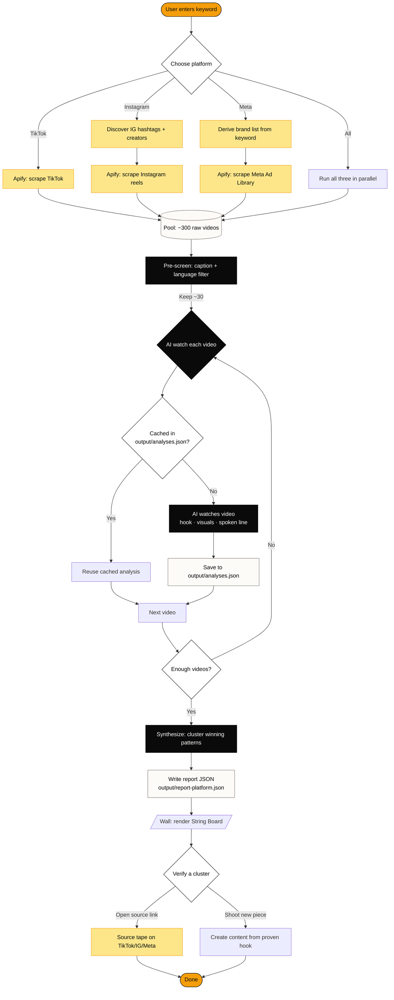

<p align="center">
  <a href="https://github.com/manish-9245/WhyViral">
    
  </a>
</p>

<p align="center">
  <a href="https://github.com/manish-9245/WhyViral/stargazers"></a>
  <a href="https://github.com/manish-9245/WhyViral/network/members"></a>
  <a href="https://github.com/manish-9245/WhyViral/issues"></a>
  <a href="https://github.com/manish-9245/WhyViral/blob/main/LICENSE"></a>
  <a href="https://www.npmjs.com/package/whyviral"></a>
  <a href="https://nextjs.org"></a>
  <a href="https://github.com/manish-9245/WhyViral/actions"></a>
  <a href="https://github.com/manish-9245/WhyViral/releases"></a>
</p>

# WhyViral

> **Answer the only question that matters: *why does this work?***

WhyViral watches real videos from **TikTok**, **Instagram**, and **Meta** — then pins the **hooks**, **visuals**, and **angles** that earn distribution, each with a **proof link** to the source tape.

Built by [**Manish Tiwari**](https://github.com/manish-9245) for strategists who need proof, not opinions.

🌐 [buildwithmanish.com](https://buildwithmanish.com) · ⭐ [github.com/manish-9245/WhyViral](https://github.com/manish-9245/WhyViral) · 📺 [Watch a 60s demo](#) · 💬 [Discussions](https://github.com/manish-9245/WhyViral/discussions)

---

## Table of contents

- [Why WhyViral](#why-whyviral)
- [How it works](#how-it-works)
- [Features](#features)
- [Quick start](#quick-start)
- [Usage](#usage)
- [Configuration](#configuration)
- [Tech stack](#tech-stack)
- [Roadmap](#roadmap)
- [Project structure](#project-structure)
- [Commands](#commands)
- [Contributing](#contributing)
- [Author](#author)
- [License](#license)
- [Star history](#star-history)

---

## Why WhyViral

Most "viral" tools show you numbers. **WhyViral shows you the *why*.**

For every keyword you search, it:

1. **Scrapes** the top videos on TikTok, Instagram, and Meta.
2. **Watches** every video with a vision-capable model — extracting the hook, the visual pattern, the spoken line, and the angle.
3. **Clusters** the patterns that show up repeatedly across winners.
4. **Pins** every cluster to the source tape so you can verify before you create.

No hand-wavy heuristics. No opaque scores. Just the patterns that **actually earned distribution** — with the receipts.

---

## How it works



A static SVG copy is at [`docs/how-it-works.svg`](./docs/how-it-works.svg) for offline use.

---

## Features

| | |
|---|---|
| 🎯 **Multi-platform** | Search TikTok, Instagram, and Meta from a single query |
| 🤖 **AI video analysis** | Every video is watched; hooks, visuals, spoken lines are extracted |
| 🔗 **Proof-linked** | Every pattern pins to the source video with a direct link |
| 🧠 **Auto keyword expansion** | Discovers related terms to widen the search without drift |
| 🧱 **Granular pipeline** | Scrape → prescreen → watch → deep → synth, resumable from any stage |
| 💾 **Local & private** | Runs on your machine; data never leaves it |
| 💸 **Transparent cost** | Real per-stage cost in the UI before and after a run |
| 🗂️ **Flat-file storage** | All reports in `output/` as JSON — diffable, version-controllable |
| 🧰 **REST API** | Programmatic access via `POST /api/run`, `GET /api/state`, `GET /api/cache` |
| ⌨️ **Keyboard friendly** | Console + History + Report + Settings — full UI in plain HTML |

---

## Quick start

### 1. Clone & install

```bash
git clone https://github.com/manish-9245/WhyViral.git
cd WhyViral
npm install
```

### 2. Add your API keys

```bash
cp .env.example .env
```

Edit `.env` and add:
- `APIFY_TOKEN` — [get from apify.com](https://apify.com) (scrapes videos)
- `GEMINI_API_KEY` — [get from aistudio.google.com](https://aistudio.google.com) (watches videos)

### 3. Run

```bash
npm run all
```

Opens at **http://localhost:3000** — enter a keyword like `magnesium gummies`, pick a platform, hit **Run**.

> First run takes a few minutes (the AI is watching real videos). After that, the local cache makes re-runs nearly free.

---

## Usage

1. Enter a 2–3 word keyword (e.g., `magnesium gummies`, `knee pain`, `ai agents`).
2. Pick a platform — **TikTok**, **Instagram**, **Meta**, or **all**.
3. Set how many videos to analyze (5 / 10 / 20 / 30 / 50 / 100).
4. Hit **Run** — the Wall tab shows clusters of winning patterns, each pinned to its source tape.

### Programmatic

```bash
# Start a run
curl -X POST http://localhost:3000/api/run \
  -H "Content-Type: application/json" \
  -d '{"keyword":"magnesium gummies","platform":"tiktok","videoCount":10}'

# Poll the pipeline state
curl http://localhost:3000/api/state?platform=tiktok

# Inspect a report
curl http://localhost:3000/api/report?platform=tiktok
```

---

## Configuration

| Variable | Default | Description |
|---|---|---|
| `APIFY_TOKEN` | — | **required.** Apify API token |
| `GEMINI_API_KEY` | — | **required.** Gemini API key |
| `GEMINI_MODEL` | `gemini-3.5-flash` | Model used to watch videos |
| `VIDEO_COUNT` | `5` | Videos per run |
| `RANK_BY` | `engagement` | `engagement` / `reach` / `views` |
| `VIEW_FLOOR` | `100000` | Skip tapes below this view count |
| `LANGUAGE` | `en` | `en` / `id` / `any` |
| `COUNTRY` | `US` | `US` / `GB` / `AU` / `IN` / `CA` / `ALL` |
| `DEEP_COUNT` | `8` | How many tapes get a deep read (0 = off) |

The in-app **Settings** page writes these to `.env` and calls **Check Connections** to verify Apify + Gemini are reachable.

---

## Tech stack

- [**Next.js 15**](https://nextjs.org) — UI framework (App Router)
- [**Tailwind CSS**](https://tailwindcss.com) — styling
- **TypeScript** — strict, end-to-end
- [**Apify**](https://apify.com) — TikTok / Instagram / Meta scrapers
- **Vision-capable model** — watches every video

---

## Roadmap

- [x] Multi-platform scrape (TikTok / Instagram / Meta)
- [x] Per-video AI analysis with caching
- [x] Proof-linked wall of winning patterns
- [x] Granular pipeline with resume
- [x] Local cost estimator
- [x] REST API for headless use
- [ ] YouTube Shorts support
- [ ] Twitter / X video support
- [ ] Multi-keyword batch runs
- [ ] Webhook notifications on pipeline completion
- [ ] Pluggable scraper adapters (bring your own actor)

See [open issues](https://github.com/manish-9245/WhyViral/issues) for the full list.

---

## Project structure

```
WhyViral/
├── src/
│   ├── app/                 # Next.js routes (Console, History, Report, Settings)
│   │   └── api/             # REST endpoints
│   ├── components/          # Shared UI (Logo, Nav, etc.)
│   ├── lib/                 # Types, formatters
│   └── mastra/              # Pipeline agents + helpers
│       └── lib/             # scrape, watch, synth, state, cache
├── public/
│   ├── logo.svg             # Brand mark
│   └── og-image.png         # Social preview (1280×640)
├── docs/
│   ├── how-it-works.mmd     # Mermaid source
│   ├── how-it-works.svg     # Static diagram
│   └── screenshots/         # UI captures
├── output/                  # All run data, gitignored
├── .github/
│   ├── ISSUE_TEMPLATE/      # Bug, feature, question
│   ├── workflows/           # CI, release, stale, labeler
│   ├── FUNDING.yml          # GitHub Sponsors
│   ├── CODEOWNERS
│   ├── SECURITY.md
│   ├── CONTRIBUTING.md
│   └── dependabot.yml
├── LICENSE                  # MIT
└── README.md                # you are here
```

---

## Commands

| Command | Description |
|---|---|
| `npm run dev` | Start Next.js dev server (clears `.next` first) |
| `npm run all` | Start Next.js + workflow dev together |
| `npm run build` | Build for production |
| `npm run start` | Run production build |
| `npm run clean` | Clear `.next`, `.turbo`, `node_modules/.cache` |
| `npm run typecheck` | TypeScript check |
| `npm run lint` | Lint `src/` |

---

## Contributing

We love PRs. Read [`CONTRIBUTING.md`](./.github/CONTRIBUTING.md) first, then:

1. Fork & branch off `main` (`feat/<short-name>` or `fix/<short-name>`).
2. Make your change. Run `npm run typecheck && npm run build`.
3. If your change touches the pipeline, do a real local run on a keyword.
4. Open a PR — fill in the [PR template](./.github/PULL_REQUEST_TEMPLATE.md).

> First-time contributor? Look for issues labelled [`good first issue`](https://github.com/manish-9245/WhyViral/issues?q=is%3Aopen+label%3A%22good+first+issue%22).

---

## Show your support

If WhyViral saved you a research sprint, give it a ⭐ — it helps more than you think.

<a href="https://github.com/manish-9245/WhyViral">
  
</a>

---

## Author

**Manish Tiwari** — [@manish-9245](https://github.com/manish-9245) · [buildwithmanish.com](https://buildwithmanish.com)

WhyViral is one of several open-source tools from Manish. Browse them all at [buildwithmanish.com](https://buildwithmanish.com).

---

## License

[MIT](./LICENSE) — free to use, modify, and distribute. © 2026 Manish Tiwari.

---

## Star history

<a href="https://star-history.com/#manish-9245/WhyViral&Date">
  <picture>
    <source media="(prefers-color-scheme: dark)" srcset="https://api.star-history.com/svg?repos=manish-9245/WhyViral&type=Date&theme=dark" />
    <source media="(prefers-color-scheme: light)" srcset="https://api.star-history.com/svg?repos=manish-9245/WhyViral&type=Date" />
    
  </picture>
</a>

<sub>Built with patience and far too much coffee by <a href="https://buildwithmanish.com">Manish Tiwari</a>.</sub>
